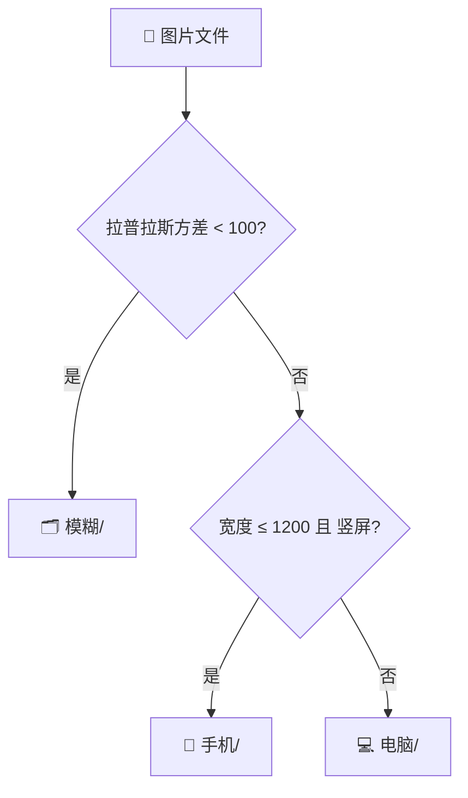

# 📦 图片分类工具 (image-classifier)

一键将压缩包（ZIP / TAR / 7Z / RAR）内的图片按 **手机图片**、**电脑图片**、**模糊图片** 自动分类，输出与原格式一致的分类压缩包。

---

## 🚀 快速开始

在 Linux VPS 上执行：

```bash
bash <(curl -sSL https://raw.githubusercontent.com/chihirosyd/image-classifier/main/install.sh)
```

脚本会自动：检测网络 → 下载代码 → 启动交互菜单 → 引导你完成环境安装和图片分类。

---

## ✨ 核心功能

| 功能 | 说明 |
|------|------|
| 🗜️ 多格式 | 支持 ZIP / TAR / TAR.GZ / 7Z / RAR 压缩包 |
| 📱 智能分类 | 宽度 ≤ 1200px 且竖屏（高 > 宽）→ 手机；其余 → 电脑 |
| 🔍 模糊检测 | OpenCV 拉普拉斯方差（Laplacian Variance），阈值 100 |
| ⚡ 并行处理 | 多进程并行分类，自动检测 CPU 核心数，速度提升 3-4× |
| 📊 实时进度 | 每 500 张打印一次，显示速度 + 预计剩余时间（ETA） |
| 💾 磁盘预估 | 运行前检查临时+输出双分区空间，不足时告警 |
| 🧹 自动清理 | try/finally 机制，异常退出也不残留临时文件 |
| 🌐 网络自适应 | GitHub 直连 → ghproxy 镜像 → 自定义镜像，三级降级 |
| ☕ 低优先级 | 支持 `nice -n 19` 降低 CPU 优先级 |
| 🖥️ 后台运行 | 集成 `screen`，断开 SSH 任务不中断 |

---

## 📁 项目结构

```
image-classifier/
├── classify.py      # Python 核心分类引擎
├── classifier.sh    # Bash 交互式管理菜单
├── install.sh       # 一键安装脚本
├── config.json      # 默认配置文件
├── .gitignore       # Git 忽略规则
├── VERSION          # 版本号
├── CHANGELOG.md     # 更新日志
└── README.md        # 说明文档
```

---

## 🎯 分类规则详解



| 类别 | 判定条件 |
|------|----------|
| **模糊** | `laplacian_var < 100`（可在 `classify.py` 调整 `BLUR_THRESHOLD`） |
| **手机** | 清晰 + `width ≤ 1200` + `height > width`（竖屏） |
| **电脑** | 清晰 + 不满足手机条件 |

---

## ⚙️ 可调参数

参数支持三种方式设置（**优先级从高到低**）：

```
命令行参数  >  配置文件(config.json)  >  代码默认值
```

### 方式一：交互式菜单调整（推荐）

```bash
bash classifier.sh  →  选择 [4] 调整分类参数
```

按提示输入新值，直接回车保留当前值，自动保存到 `config.json`。

### 方式二：命令行参数

```bash
python classify.py 图片.zip --phone-width 1200 --blur-threshold 80 --log-interval 200
```

### 方式三：配置文件

仓库已包含默认 `config.json`，可直接修改或用菜单覆盖：

```json
{
  "phone_max_width": 1200,
  "blur_threshold": 100,
  "log_interval": 500,
  "workers": 0,
  "temp_dir": "",
  "output_dir": ""
}
```

> `workers: 0` 表示自动检测 CPU 核心数；`temp_dir: ""` 表示使用系统临时目录。

### 参数说明

| 参数 | 默认值 | 说明 |
|------|:--:|------|
| `phone_max_width` | 1200 | 手机判定最大宽度（像素），≤此值且竖屏 → 手机 |
| `blur_threshold` | 100 | 模糊敏感度：越低越宽松，越高越严格 |
| `log_interval` | 500 | 每处理多少张打印一次进度 |
| `workers` | 0 | 并行进程数，0=自动检测，设为 1 可禁用并行 |
| `temp_dir` | "" | 临时目录路径，留空=系统默认（如 /tmp） |
| `output_dir` | "" | 输出目录路径，留空=脚本目录下的 output/ |

### 其他 CLI 选项

```bash
python classify.py --show-config          # 查看当前生效的配置
python classify.py --save-config          # 将当前参数保存为 config.json
python classify.py --config my.json ...   # 指定配置文件路径
python classify.py --workers 4 ...        # 指定并行进程数
python classify.py --no-parallel ...      # 禁用并行处理
python classify.py --temp-dir /opt/tmp ... # 指定临时目录
python classify.py --version              # 显示版本号
```

---

## 📋 使用方式

### 方式一：交互式菜单（推荐）

```bash
bash classifier.sh
```

```
========================================
      图片分类工具 vX.X
========================================
1) 环境准备（创建虚拟环境 + 安装依赖）
2) 运行图片分类（支持 screen 后台）
3) 查看正在运行的任务
4) 调整分类参数
5) 查看当前配置
6) 清理环境（删除虚拟环境）
7) 更新脚本
0) 退出
========================================
```

### 方式二：命令行直接运行

```bash
# 先安装依赖
python3 -m venv classify_env
source classify_env/bin/activate
pip install opencv-python-headless numpy

# 运行分类
python3 classify.py 图片包.zip
# → 输出 classified_20260803_150530_图片包.zip（classified_时间戳_源文件名）
```

---

## 📊 运行示例

```
当前参数：手机宽度≤1200px | 模糊阈值=100 | 进度间隔=500张 | 进程=4（并行，CPU 4 核）
==================================================
磁盘空间检查
==================================================
压缩包大小: 2.35 GB（解压后预估 5.88 GB）
输出包预估: 约 2.35 GB

📁 工作分区（临时 + 输出在同一分区）:
  总 50.00 GB | 可用 32.50 GB
  峰值占用: 9.23 GB（解压 5.88 + 输出 2.35 + 1GB 余量）

✅ 磁盘空间充足，可以安全运行。
输出文件: ~/image-classifier/output/classified_20260803_150530_images.zip

正在解压 images.zip ...
  解压完成。
正在扫描图片文件...
共发现 8421 张图片，开始分类...

  [500/8421] 手机:200 电脑:250 模糊:45 跳过:5 错误:0 | 12.3 张/秒 | 预计剩余 644s
  [1000/8421] 手机:410 电脑:480 模糊:100 跳过:10 错误:0 | 11.8 张/秒 | 预计剩余 629s
  ...

==================================================
分类完成！总耗时 685 秒 | 平均 12.3 张/秒
==================================================
  📱 手机 :   3200 张
  💻 电脑 :   4500 张
  🔍 模糊 :    680 张
  ⏭️  跳过 :     41 张
  ❌ 错误 :      0 张
  📦 合计 :   8421 张

正在创建分类压缩包 classified_20260803_150530_images.zip ...
全部完成！请下载: ~/image-classifier/output/classified_20260803_150530_images.zip
```

---

## 📦 依赖

| 依赖 | 用途 | 安装 |
|------|------|------|
| Python 3.7+ | 运行环境 | 系统自带或 `apt install python3` |
| opencv-python-headless | 图像读取 + 拉普拉斯方差 | `pip install opencv-python-headless` |
| numpy | cv2 传递依赖 | 随 opencv 自动安装 |
| screen | 后台运行（可选） | `apt install screen` |

---

## ❓ 常见问题

<details>
<summary><b>Q: 模糊阈值 100 是否合适？</b></summary>

默认值 100 对大多数场景适用。如果模糊图太多，降低阈值（如 50）；如果模糊图太少，提高阈值（如 200）。运行后查看 `模糊/` 文件夹，根据结果微调。
</details>

<details>
<summary><b>Q: 支持哪些图片格式？</b></summary>

`.jpg` `.jpeg` `.jfif` `.png` `.gif` `.bmp` `.webp` `.tiff` `.tif` `.ico` `.heic` `.heif`，共 12 种。
</details>

<details>
<summary><b>Q: 超大压缩包会不会爆内存？</b></summary>

不会。图片**逐张读取处理**，不会一次性加载所有图片到内存。但解压需要磁盘空间（约 2.5 倍压缩包大小），脚本会提前检查。
</details>

<details>
<summary><b>Q: 支持哪些压缩格式？</b></summary>

`.zip` `.tar` `.tar.gz` `.tgz` `.tar.bz2` `.7z` `.rar`。输出格式默认与输入一致（7z/rar 通过 7z 解压，输出回退为 zip）。其中 7z 需 `p7zip-full`，`install.sh` 会自动提示安装。
</details>

<details>
<summary><b>Q: 国内 VPS 下载慢怎么办？</b></summary>

`install.sh` 已内置 ghproxy 镜像自动切换。手动安装可设 pip 镜像：

```bash
pip install -i https://mirrors.aliyun.com/pypi/simple/ opencv-python-headless numpy
```
</details>

---
